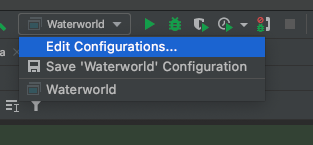
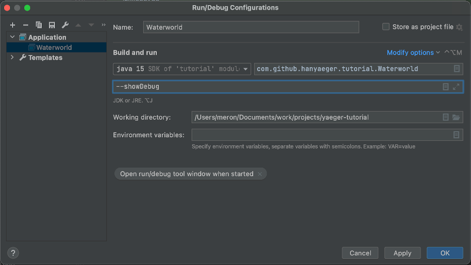

# Adding Dynamic Entities

Before adding Hanny, lets start by adding her enemy, the evil Swordfish. Since this fish will be based on the image
`sprites/swordfish.png` and he will swim around, we will be using a `DynamicSpriteEntity`.

## Add the `Swordfish`

 Create a new Class called `Swordfish` that extends `DynamicSpriteEntity` in
package `com.github.hanyaeger.tutorial.entities`. Since the image of the swordfish is already of the correct size, we
don't need to set its size through the constructor, which can now look like:

```java
public Swordfish(Coordinate2D location){
    super("sprites/swordfish.png",location);
}
```

Notice how we call `super()` and pass the *image*, the *location* and the *size* to the constructor of the Super Class.

## Animate the `Swordfish`

Since the Swordfish is a `DynamicSpriteEntity`, we can let it move around the Scene. To do this, we will need to set
both the *direction* and *speed*. The *direction* will be an angle in degrees, where 0 denotes upwards. For convenience,
Yaeger supplies a method to set both values at once. For the trivial directions (up, left, right and down)
Yaeger provides an Enumeration called `Direction`, which can also be passed to the method.

 Add the following method-call to the constructor of `Swordfish`, just after the call to `super`:

```java
setMotion(2,270d);
```

 Now use the `setupEntities()` from the `GameLevel` to add `Swordfish`.

 Run the game again. You should now see a Swordfish that swims from right to left and then disappears of
the screen.

## Make the Swordfish swim in circles

Now we would like to add behaviour that notifies us when the Swordfish has left the Scene. That way we can place him to
the right of the Scene, and make him reappear and continue his path.

As seen before, adding behaviour is being done by implementing the correct interface. In this case, Yaeger supplies the
interface `SceneBorderCrossingWatcher`.

 Let `Swordfish` implement the interface `SceneBorderCrossingWatcher` and implement the event handler in the
following way:

```java
@Override
public void notifyBoundaryCrossing(SceneBorder border){
    setAnchorLocationX(getSceneWidth());
}
```

 Run the game again and see what happens. To also change the y-coordinate at which the Swordfish
reappears, you can add the following method
call: ` setAnchorLocationY(new Random().nextInt((int) getSceneHeight() - 81));`
to the handler.

## Use the build-in debugger to see what is happening

Yaeger contains a simple debugger that displays how much memory is used by the game and how many Entities are currently
part of the game. When a game doesn't work as expected, you can use this debugger to get some inside information.

 Run the game with the commandline argument `--showDebug`. Setting these options can usually be done from
the Run Configuration in your IDE. When using IntelliJ, first select "Edit Configurations...":



Add the commandline argument to the correct Run Configuration:



See if you can relate the stated numbers to what you expect from your game. To disable the Debugger window, just remove
the commandline argument from the Run Configuration.
