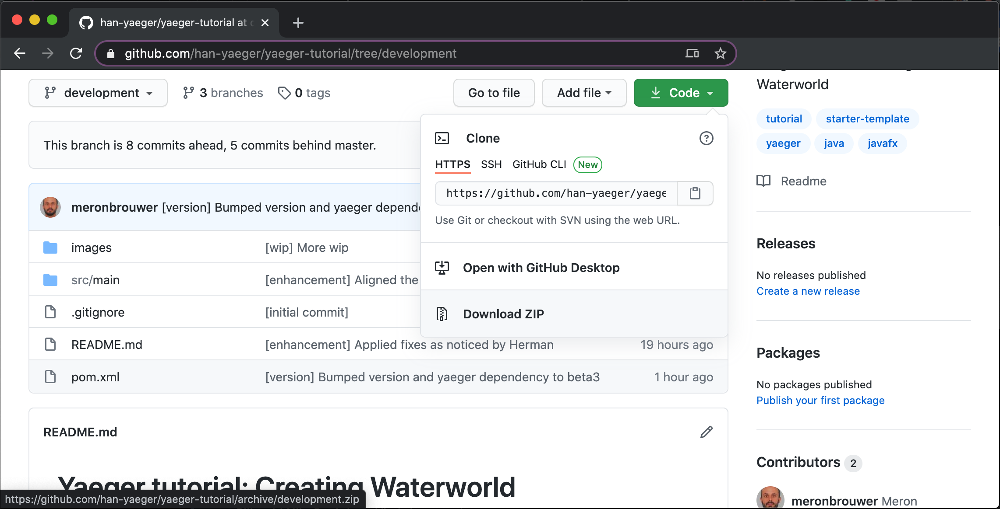

# Creating your first Yaeger Game

We are going to create a game that consists of three **Scenes**. A Title Scene, a GameLevel Scene and a Game Over Scene.
The Game itself will be about a fish called Hanny, that swims in the ocean and tries to pop air bubbles. Sadly most
bubbles contain a poisonous gas and popping to many of those kills Hanny. Not only Hanny swims in the ocean, but
so does an evil Shark. If he gets his hands on Hanny, Hanny gets eaten.

## Clone the starter project

We provide a repository, that contains both a starter project and the required assets. Either clone this repository to
your local machine, or download the zip file.

The project is a Maven project, which will be recognized by all modern IDE's. Knowledge of Maven is therefore not
required. But just to paint the full picture, you'll find a `pom.xml` file at the root of the project. This file
contains the full project setup and you will notice the dependency it has on `Yaeger`.

### Switch Branch to look at the solution

Whenever your stuck, you can switch to Branch *implementation*, to see the full implementation.

### Importing the project in IntelliJ

1. Select *File > Open...*
2. In the **import window**, navigate to the project directory. Notice that this directy contains a `pom.xml` file.
   Select this `pom.xml` file and press *Open*.
3. IntelliJ will notice that you are opening a `pom.xml` file and will ask if it needs to open the enitre project:

   

   In the **Open Project Window** select **Open as Project**

### Importing the project in Eclipse

1. Select *File > Import...*
2. In the **import window**, expand *maven*, select *Existing Maven Projects*, and click *Next:*

    

3. Click *Browse* and select the project directory. Notice that this directory contains a `pom.xml` file:

    
